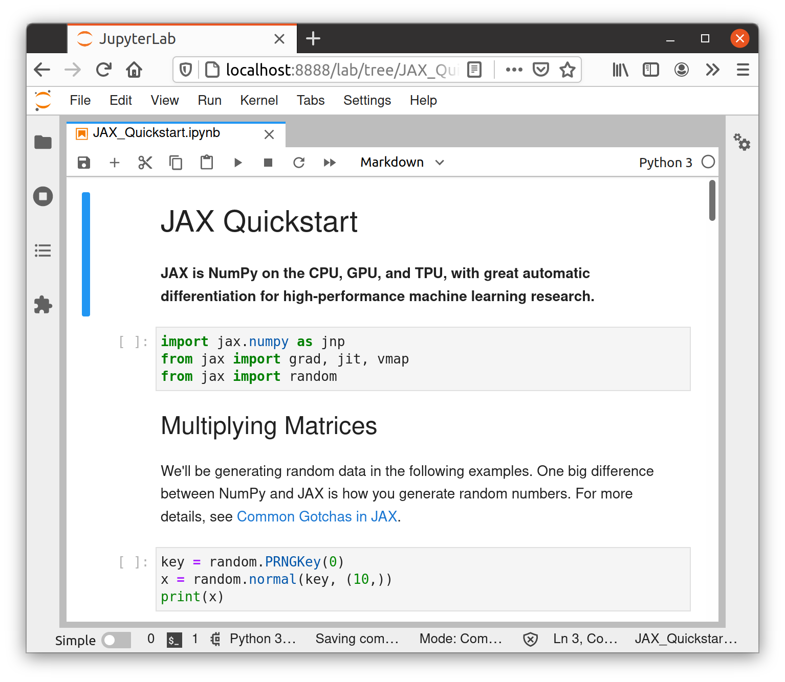
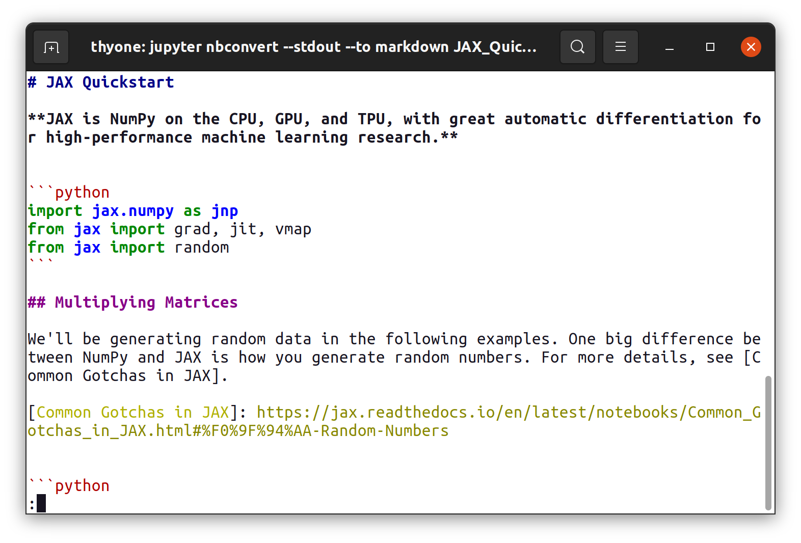

+++
title = "Viewing Jupyter notebooks at the command line"
date = 2020-09-23
+++

The Jupyter notebook is a literate programming environment which has become
ubiquitous in scientific computing. While the standard tools for interacting
with notebooks are web applications, it’s often useful to be able to view
notebooks at the command line. I find this convenient when logged into a remote
machine via SSH, and the process of configuring SSH to forward a port, starting
a Jupyter server, and navigating to it in a web browser is a chore just to view
a notebook for a few seconds.

<!-- more -->

Viewing other literate programming formats such as [R Markdown] and [Pweave] at
the command line is trivial: these use lightweight markup languages which don’t
need special rendering to be legible. As such it’s sufficient to print the raw
file contents to the terminal, for example with `cat`.

This isn’t the case for Jupyter notebooks. Internally, notebooks are structured
JSON documents with a [strict schema][notebook schema]. Notebooks can contain
images and other binary data, which if viewed with a pager will print
unintelligible Base64 encoded data to your terminal. Characters such as `"` are
backslash-escaped, making copying code from the output laborious.

Instead of printing the notebook file directly to the terminal, we’ll convert it
to another format first. [`nbconvert`][nbconvert] is a program to convert
notebooks to rich formats including HTML and PDF, as well as plain text such as
[Markdown][commonmark]. By design, Markdown syntax is unobtrusive and readable
in plain text without rendering, so it’s a good choice for our output format.

As an example, we’ll use a notebook which contains both prose and code cells
taken from the [documentation for JAX][jax docs].



We can use `nbconvert` to convert the notebook to Markdown, printing the output
to standard output.

    $ jupyter nbconvert --stdout --to markdown JAX_Quickstart.ipynb
    [NbConvertApp] Converting notebook JAX_Quickstart.ipynb to markdown
    # JAX Quickstart

    **JAX is NumPy on the CPU, GPU, and TPU, with great automatic
    differentiation for high-performance machine learning research.**

    ```python
    import jax.numpy as jnp
    from jax import grad, jit, vmap
    from jax import random
    ```

    ## Multiplying Matrices

    We'll be generating random data in the following examples. One big
    difference between NumPy and JAX is how you generate random numbers. For
    more details, see [Common Gotchas in JAX].

    [Common Gotchas in JAX]: https://jax.readthedocs.io/en/latest/notebooks/Common_Gotchas_in_JAX.html#%F0%9F%94%AA-Random-Numbers

    ```python
    key = random.PRNGKey(0)
    x = random.normal(key, (10,))
    print(x)
    ```

`nbconvert` writes the header
`[NbConvertApp] Converting notebook JAX_Quickstart.ipynb to markdown` to
standard error and the notebook body to standard output, so we can filter out
the header by redirecting standard error.

```bash
jupyter nbconvert --stdout --to markdown JAX_Quickstart.ipynb 2>/dev/null
```

_This redirection syntax is for Bourne-like shells such as Bash. If you’re using
an alternative such as fish, change as appropriate._

This is already more readable than the raw JSON document, but we can improve the
readability of the code cells by applying syntax highlighting. We’ll pipe the
output of `nbconvert` to `pygmentize`, a command line interface to the
[Pygments] syntax highlighting library. Pygments is a dependency of `nbconvert`,
so if you’ve followed to here you’ll already have it installed.

As we’re piping text to `pygmentize` on standard input, there’s no filename from
which to determine the language of the input so we specify it using the `-l`
flag.

```bash
jupyter nbconvert --stdout --to markdown JAX_Quickstart.ipynb 2>/dev/null \
    | pygmentize -l md
```

We can pipe the output of `pygmentize` to a pager like `less` to scroll through
and search within the notebook.

```bash
jupyter nbconvert --stdout --to markdown JAX_Quickstart.ipynb 2>/dev/null \
    | pygmentize -l md | less -R
```

The `-R` flag instructs `less` to output ANSI escape sequences in raw form in
order to colour the output. If we run this command, we’ll get a legible
rendering of the notebook with syntax highlighting. Thanks to `less`, we can
scroll up and down through the notebook, and search within it by pressing `/`
and typing a query.



However, this is a longer command than is convenient to type for each use, so
let’s create a shell script to encapsulate it, and also take the opportunity to
implement some input validation.

```bash
#!/usr/bin/env bash

set -euo pipefail

readonly EX_USAGE=64
readonly EX_NOINPUT=66
readonly EX_UNAVAILABLE=69

usage() {
    echo "usage: $(basename "$0") [-h] NOTEBOOK"
    echo
    echo "Convert a Jupyter notebook to Markdown and view with less"
}

if [[ $# -ne 1 ]]; then
    usage
    exit $EX_USAGE
fi

if [[ "$1" = -h || "$1" = --help ]]; then
    usage
    exit
fi

if [[ ! -f "$1" ]]; then
    echo "$(basename "$0"): $1: No such file"
    exit $EX_NOINPUT
fi

if ! command -v jupyter >/dev/null; then
    >&2 echo "$(basename "$0"): command not found: jupyter"
    exit $EX_UNAVAILABLE
fi

jupyter nbconvert --stdout --to markdown "$1" 2>/dev/null | pygmentize -l md \
    | less -R
```

If we save this as an executable script on our shell’s command search path, for
example as `nbless`, next time we’re at the command line on a remote machine and
want to view a notebook it’s as simple as `nbless notebook.ipynb`—no port
forwarding, Jupyter server, or web browser required.

[commonmark]: https://commonmark.org/
[jax docs]: https://jax.readthedocs.io/en/latest/notebooks/quickstart.html
[nbconvert]: https://nbconvert.readthedocs.io/
[notebook schema]:
  https://github.com/jupyter/nbformat/blob/3af03b7804357d967aa035d677c5be64c8a86680/nbformat/v4/nbformat.v4.schema.json
[pweave]: http://mpastell.com/pweave/
[pygments]: https://pygments.org/
[r markdown]: https://rmarkdown.rstudio.com/
